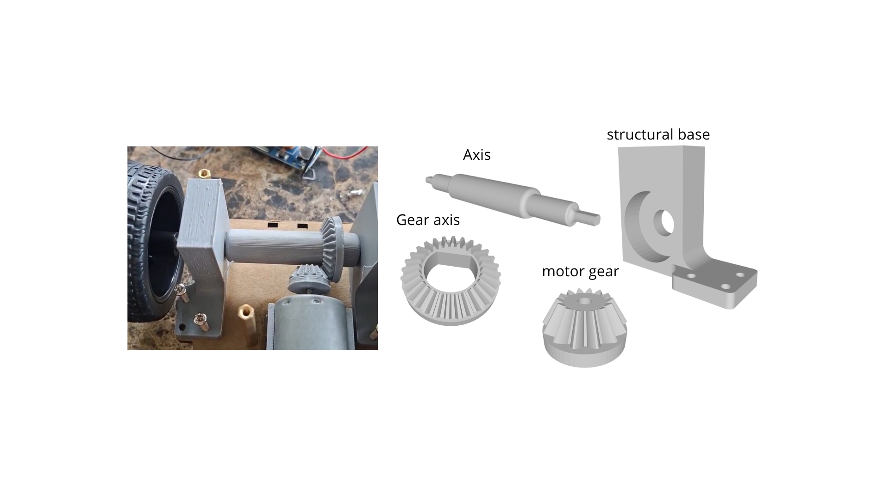

# WRO_2026_UDBTEAM
Proyecto del vehículo autónomo para WRO 2026 - Futuros Ingenieros

# Self-Driving Car Challenge Documentation

## Introduction
This repository is the documentation for the self-driving car challenge designed by the Universidad Don Bosco students to participate in the 2026 World Robot Olympiad Future Engineers. This is a competition where a self-driving car should complete 2 challenges, the first is being able to take 3 laps around a square course and stop and the second is taking the same course but with red obstacles that the car should pass on the right and green obstacles on the left. The car steering direction is controlled by servo motor MG90S, the traction is controlled by an electric motor connected to by gears that duplicate torque and the detection of obstacles is done trough a Huskylens camara, ultrasonic sensors and a color sensor. The embedded system is controlled by an Arduino Mega and is powered by 2 18650 li-ion batteries regulated to 6V to supply the servo motor  and 4 19640 li-ion batteries to supply the electric motor.

---

## Traction
Traction is controlled by a motor driver L298N connected to an electric motor with a pair of gears that duplicate torque. These parts where designed by the team and the stl file are available in this repository.

---

## Steering
The steering is controlled by a MG90S servo motor using some parts of the LK KOKOINO Rear-Wheel drive robot car kit.

---

## Decision Making

### Open Challenge
The ultrasonic sensors on the left and right side of the car are used to measure how close to the center of the track the car is and change the steering angle to maintain the car in the center. When the sum of the distances is larger than 130 cm the car is likely near the corner, so it steers to the direction with the largest distance. While the car is turning the readings are ignored for a fixed amount of time and then the loop continues.

here is the youtube link of the first time the car did the open challenge: https://www.youtube.com/watch?v=LxlPVEr9SCA

### Obstacle Challenge
The color sensor  checks every iteration of the loop for the orange and blue lines to know if it must turn if not it checks for the nearest obstacle detected  by the camera, stores the color cube in a variable and calculates how far is the nearest obstacle from the center in the horizontal axis this distance is used to keep the nearest cube in front of the car, then the car approaches the  obstacle using the front ultrasonic sensor to avoid getting to close to it and then it turns right or left depending on the last color stored in memory then the code repeats.